# Google Workspace 教育應用研習 - 25 個全實作原創情境演練手冊

> **研習教學策略**：本手冊將原本的所有考試觀念與題目，完全重構轉化為 **25 個真實教學與教育行政場景**。  
> 沒有單選題、沒有考題痕跡，學員將直接開啟 Google Workspace 工具，跟著 **「情境課題 $\rightarrow$ 指定工具功能 $\rightarrow$ 手把手實操步驟 $\rightarrow$ 驗證點」** 進行真實的修改與功能設定！

---

## 🛠️ 25 個原創實務修改與設定演練清單

### 📄 【Google Docs 文件應用實務】

#### 演練 01：全校週報校長姓名全篇快速更正 (取代工具)

> 🔗 **線上真實 Google Docs 實作檔連結**：  
> 📄 **[https://docs.google.com/document/d/1kE7fdTcA9Po3xXxpHmt-iaC1EQtKI0QVuEN8HhnQcXE/copy](https://docs.google.com/document/d/1kE7fdTcA9Po3xXxpHmt-iaC1EQtKI0QVuEN8HhnQcXE/copy)**  
> （點選開啟即可直接在文件內按下 `Ctrl + H`，將舊校長姓名 `陳大文` 一鍵取代為 `張小明`！）

- **🎯 實務情境課題**：您編輯完一份長達 10 頁的全校週報後，才發現將本學期新到的校長姓名全篇都打錯了（如：將 `陳大文` 誤打為 `陳大文` 舊名）。您需要快速定位並修正所有錯字。
- **🛠️ 指定工具功能**：Google Docs 的 **尋找與取代 (Find & Replace)**
- **▶️ 手把手實操步驟**：
  1. 開啟 Docs 文件，按下快捷鍵 `Ctrl + H`（或點選「編輯 $
ightarrow$ 尋找與取代」）。
  2. 在「尋找」輸入舊姓名（例如：`陳大文`）。
  3. 在「替換為」輸入正確的新校長姓名（例如：`張小明`）。
  4. 點選「全部替換 (Replace All)」。
- **✨ 成果驗證點**：全篇文件的所有舊校長姓名皆在一秒內自動更正為新姓名。

---

#### 演練 02
> 🔗 **雲端真實線上 Docs 實作檔案網址**：[https://docs.google.com/document/d/1ruUrTP1THD2J2LTbcTy3H2R0cinGNYdOBOY9c-aqwGI/copy](https://docs.google.com/document/d/1ruUrTP1THD2J2LTbcTy3H2R0cinGNYdOBOY9c-aqwGI/copy)
：校慶運動會籌備會議記錄與動態任務追蹤 (智慧晶片)
- **🎯 實務情境課題**：您正在編輯運動會籌備會議紀錄，需要明確指派各項器材租借的負責同仁，並設定完成期限。
- **🛠️ 指定工具功能**：Google Docs **智慧型畫布 (Smart Canvas `@People` 與 `@Date`)**
- **▶️ 手把手實操步驟**：
  1. 在任務欄位輸入 `@` 符號，彈出選單後選取 `@People` 指派夥伴 Email。
  2. 在截止日欄位輸入 `@` 符號，選取 `@Date` 在彈出行事曆中點選完成日期。
- **✨ 成果驗證點**：文字自動轉換為可點擊互動的人員與日期名片卡。

---

#### 演練 03
> 🔗 **雲端真實線上 Docs 實作檔案網址**：[https://docs.google.com/document/d/1xmyGLVmyT86_gO-tWYr4K4FmKZxG0wBQ0P_1sHV39Zg/copy](https://docs.google.com/document/d/1xmyGLVmyT86_gO-tWYr4K4FmKZxG0wBQ0P_1sHV39Zg/copy)
：校本課程實施計畫手冊自動目錄製作 (段落樣式)
- **🎯 實務情境課題**：您編輯了一份包含多個章節的課程計畫手冊，希望開啟文件者能透過最上方的目錄快速點選跳轉。
- **🛠️ 指定工具功能**：Google Docs **段落樣式 (Paragraph Styles - Headings)** 與 **自動目錄**
- **▶️ 手把手實操步驟**：
  1. 選取文件中的章節標題，在工具列將段落樣式套用為「標題 1 (Heading 1)」。
  2. 移至文件開頭，點選選單「插入 $
ightarrow$ 目錄 (Table of Contents)」。
- **✨ 成果驗證點**：目錄自動抓取「標題 1」文字並生成點選跳轉連結。

---

#### 演練 04
> 🔗 **雲端真實線上 Docs 實作檔案網址**：[https://docs.google.com/document/d/15qv2cqzBkspXtIDjmiIZ7QAehMhTgXO0CMxOozEJBk8/copy](https://docs.google.com/document/d/15qv2cqzBkspXtIDjmiIZ7QAehMhTgXO0CMxOozEJBk8/copy)
：國文作文非同步親切語音講評 (擴充外掛)
- **🎯 實務情境課題**：批改學生作文時，除了打字外，您希望錄製一段親切的口頭語音，給予學生非同步的聽覺建議。
- **🛠️ 指定工具功能**：Google Docs **Workspace Marketplace 擴充外掛 (Mote)**
- **▶️ 手把手實操步驟**：
  1. 點選選單「擴充功能 $
ightarrow$ 外掛程式 $
ightarrow$ 取得外掛程式」。
  2. 搜尋安裝 Mote 語音擴充工具。
  3. 在文章段落新增批註，點選錄音發布語音註解。
- **✨ 成果驗證點**：註解區出現可直接點擊播放的語音音訊波形。

---

#### 演練 05
> 🔗 **雲端真實線上 Docs 實作檔案網址**：[https://docs.google.com/document/d/1gL8HRiBBrpEztAzvpFkt8-WoX1liBD-HujJOeJDkzSQ/copy](https://docs.google.com/document/d/1gL8HRiBBrpEztAzvpFkt8-WoX1liBD-HujJOeJDkzSQ/copy)
：新住民家長通知單一鍵雙語翻譯 (翻譯文件)
- **🎯 實務情境課題**：班上有新住民家長，您需要將中文的每週班級通訊快速轉換為越南語版本。
- **🛠️ 指定工具功能**：Google Docs **翻譯文件 (Translate Document)**
- **▶️ 手把手實操步驟**：
  1. 開啟中文通訊文件，點選頂部選單「工具 $
ightarrow$ 翻譯文件」。
  2. 選擇目標語言「越南語」，點選「翻譯」。
- **✨ 成果驗證點**：系統自動產生並開啟一份完整的越南語翻譯新文件。

---

### 📅 【Google Calendar 日曆與溝通實務】

#### 演練 06
> 🔗 **雲端真實線上 Docs 實作檔案網址**：[https://docs.google.com/document/d/1qBR1L6VobSxKetqzC8j0bD-GVTQQmxNCOk0S1UNAIqk/preview](https://docs.google.com/document/d/1qBR1L6VobSxKetqzC8j0bD-GVTQQmxNCOk0S1UNAIqk/preview)
：教師自主學習諮詢預約系統 (預約時間表)
- **🎯 實務情境課題**：您每週開放 2 小時提供學生課後諮詢，需要讓學生自主預約且不發生時間衝突。
- **🛠️ 指定工具功能**：Google Calendar **預約時間表 (Appointment Schedule)**
- **▶️ 手把手實操步驟**：
  1. 在 Calendar 點選「建立 $
ightarrow$ 預約時間表」。
  2. 設定單次諮詢時段為 20 分鐘與每週開放時間。
  3. 儲存後複製公開預約網址 (URL) 發送給學生。
- **✨ 成果驗證點**：學生點擊網址即可看見剩餘空閒時段並進行預約。

---

#### 演練 07
> 🔗 **雲端真實線上 Docs 實作檔案網址**：[https://docs.google.com/document/d/1AL2LqfbUAhAN_lNz4BcrF-bXJxsUxWidLM23vYOLddw/preview](https://docs.google.com/document/d/1AL2LqfbUAhAN_lNz4BcrF-bXJxsUxWidLM23vYOLddw/preview)
：跨校讀書會大型研討與直播開啟 (Meet 直播)
- **🎯 實務情境課題**：舉辦跨校線上講座，除了邀請主講者外，還需要開放全校數百名師生線上觀看直播。
- **🛠️ 指定工具功能**：Google Calendar **Meet 視訊與串流直播 (Live Stream)**
- **▶️ 手把手實操步驟**：
  1. 在 Calendar 建立研討會活動，點選「新增 Google Meet 視訊會議」。
  2. 點選 Meet 視訊選單下拉，點選「新增串流直播 (Add live stream)」。
- **✨ 成果驗證點**：活動中生成 Meet 視訊網址與觀看直播網址。

---

#### 演練 08
> 🔗 **雲端真實線上 Docs 實作檔案網址**：[https://docs.google.com/document/d/1G9VqLZkAKZCcK1_EwziY-8Yt58VQaBMeOmX8Ne8C1HE/preview](https://docs.google.com/document/d/1G9VqLZkAKZCcK1_EwziY-8Yt58VQaBMeOmX8Ne8C1HE/preview)
：大型研討會與會者隱私權限防護 (與會者權限)
- **🎯 實務情境課題**：邀請外部專家開會，需設定 1 小時前 Email 提醒，並禁止受邀者自行邀請他人或查看完整名單。
- **🛠️ 指定工具功能**：Google Calendar **通知與與會者權限 (Guest Permissions)**
- **▶️ 手把手實操步驟**：
  1. 在活動設定中新增通知選取「Email」，時間設為「1 小時前」。
  2. 在與會者權限中，**取消勾選「邀請他人」與「檢視與會者名單」**。
- **✨ 成果驗證點**：與會同仁無法複製或洩漏其他與會者的個資。

---

#### 演練 09
> 🔗 **雲端真實線上 Docs 實作檔案網址**：[https://docs.google.com/document/d/14xJjbd7YdMKoPKf8hzVKJyHEfoscKQcPuacDvDW3OY0/copy](https://docs.google.com/document/d/14xJjbd7YdMKoPKf8hzVKJyHEfoscKQcPuacDvDW3OY0/copy)
：學期教研會會議紀錄一鍵同步分發 (會議紀錄連動)
- **🎯 實務情境課題**：教研會開會時，需要讓所有出席者同時開啟同一份會議紀錄文件進行共筆。
- **🛠️ 指定工具功能**：Google Calendar **新增會議紀錄 (Meeting Notes)**
- **▶️ 手把手實操步驟**：
  1. 在日曆活動編輯視窗中，點選「新增會議紀錄 (Add meeting notes)」。
- **✨ 成果驗證點**：系統自動建立連動的 Docs，並將閱讀/編輯權限自動賦予所有與會者。

---

### 🏫 【Google Classroom 課堂教學與評量】

#### 演練 10
> 🔗 **雲端真實線上 Docs 實作檔案網址**：[https://docs.google.com/document/d/1wzDfR0fChCnk6vu0BpriQLGAzcAzBUJsbt8GZSqepCM/preview](https://docs.google.com/document/d/1wzDfR0fChCnk6vu0BpriQLGAzcAzBUJsbt8GZSqepCM/preview)
：跨校雙語協同教學班級建置 (協同教師)
- **🎯 實務情境課題**：您與另一位外籍教師共同授課，需要給予外師管理作業與批改成績的完整權限。
- **🛠️ 指定工具功能**：Google Classroom **協同教師 (Co-teachers)**
- **▶️ 手把手實操步驟**：
  1. 進入 Classroom「成員」頁面。
  2. 在教師區塊點選「邀請教師」，輸入外師 Email 加入為 Co-teacher。
- **✨ 成果驗證點**：外師接受後即可共同發布作業與批改成績。

---

#### 演練 11
> 🔗 **雲端真實線上 Docs 實作檔案網址**：[https://docs.google.com/document/d/1Pzd-Nztp30Sr_YXrSmhajR-NwvhCwieYiGQtG_Lw9bs/preview](https://docs.google.com/document/d/1Pzd-Nztp30Sr_YXrSmhajR-NwvhCwieYiGQtG_Lw9bs/preview)
：線上形成性評量分數一鍵同步成績冊 (成績匯入)
- **🎯 實務情境課題**：在 Classroom 發布 Google 表單測驗，希望學生完成後分數能自動帶入 Classroom 成績冊。
- **🛠️ 指定工具功能**：Google Classroom **測驗作業成績匯入 (Grade Importing)**
- **▶️ 手把手實操步驟**：
  1. 點選「建立 $
ightarrow$ 測驗作業 (Quiz Assignment)」。
  2. 確認右側「成績匯入 (Grade importing)」切換開關已開啟。
- **✨ 成果驗證點**：學生完成 Forms 測驗後，分數旁邊出現「匯入成績」按鈕。

---

#### 演練 12
> 🔗 **雲端真實線上 Docs 實作檔案網址**：[https://docs.google.com/document/d/1V_WBWKuPSOY5u-Z5nlJYfwhvS7CScq6UzO7dX6111xo/preview](https://docs.google.com/document/d/1V_WBWKuPSOY5u-Z5nlJYfwhvS7CScq6UzO7dX6111xo/preview)
：高中社會科小論文抄襲自主檢查 (原創性比對)
- **🎯 實務情境課題**：要求學生繳交小論文，希望學生在正式提交前能自己檢查是否有無意間抄襲。
- **🛠️ 指定工具功能**：Google Classroom **原創性比對報告 (Originality Reports)**
- **▶️ 手把手實操步驟**：
  1. 建立作業時，在右側側邊欄勾選「檢查原創性 (Originality reports)」。
- **✨ 成果驗證點**：學生端提交作業前可免費進行最多 3 次全網抄襲比對。

---

### 🎨 【Google Slides 簡報與互動學習】

#### 演練 13
> 🔗 **雲端真實線上 Slides 實作檔案網址**：[https://docs.google.com/presentation/d/1e4CsXlrX-6XQ8iuBBHtKUaYwmRJ66hpPoQ215IVz-as/copy](https://docs.google.com/presentation/d/1e4CsXlrX-6XQ8iuBBHtKUaYwmRJ66hpPoQ215IVz-as/copy)
：英檢單字互動記憶卡製作 (投影片超連結)
- **🎯 實務情境課題**：製作單字複習簡報，點選單字按鈕後能自動跳轉至顯示解答的特定投影片頁面。
- **🛠️ 指定工具功能**：Google Slides **投影片超連結 (Hyperlink Slides)**
- **▶️ 手把手實操步驟**：
  1. 選取簡報上的單字按鈕，按右鍵選取「連結」。
  2. 選擇「簡報中的投影片 (Slides in this presentation)」，選取目標解答頁碼。
- **✨ 成果驗證點**：簡報播放時點擊按鈕直接跳轉至解答頁。

---

#### 演練 14
> 🔗 **雲端真實線上 Slides 實作檔案網址**：[https://docs.google.com/presentation/d/18n8iq45pZ0qDogQYsFkXxp7VGBG14vyQpJtswluGjTs/copy](https://docs.google.com/presentation/d/18n8iq45pZ0qDogQYsFkXxp7VGBG14vyQpJtswluGjTs/copy)
：全校統一簡報母版與圖片預留框 (主題製作工具 Theme Builder)

##### 🧩 觀念釐清：母片階層邏輯與「套用版面配置」的對應關係
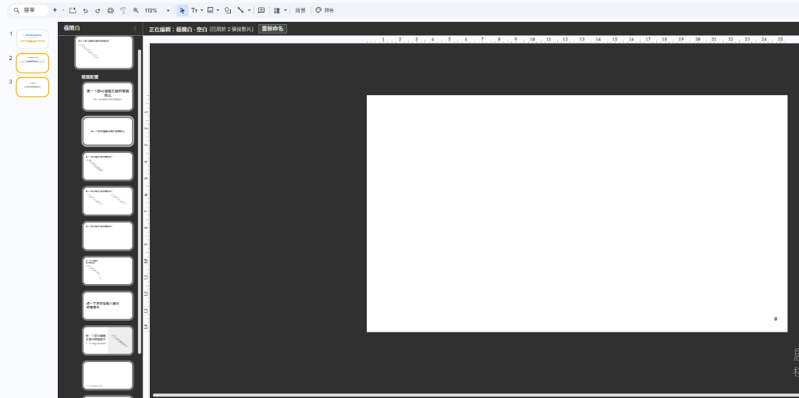
*圖 1：主題製作工具（後台模具工廠：頂部為全域主題母片，下方縮排為各版面配置）*

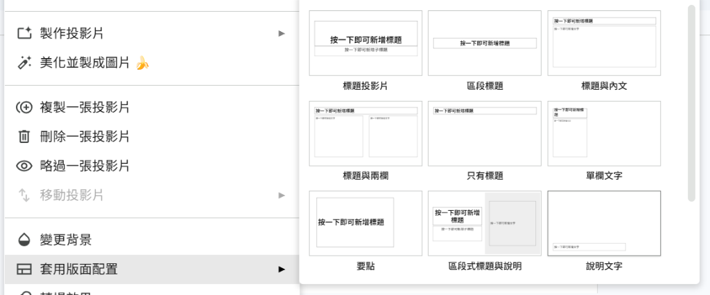
*圖 2：前台「套用版面配置」選單（與後台模具工廠一對一完全對應）*

- **👑 1. 最頂端大張【主題母片】（總指揮官）**：定義全校統一字型、背景色、角落校徽 Logo、頁碼。動這 1 張，整份簡報所有頁面自動全部套用！
- **📑 2. 底下縮排的十幾張【版面配置 (Layouts)】（各場景模具）**：針對不同教學場景（封面、內文、雙欄、照片展示）設計模具。新增的「圖片預留位置」，會直接呈現在前台的「套用版面配置」選單中供教師一鍵套用！
- **🛡️ 3. 防呆保護機制**：畫在母片／版面配置中的物件，回到一般編輯模式下點不到、刪不掉，確保格式不被改壞！

- **🎯 實務情境課題**：為學校團隊製作標準報告簡報，設置統一格式的圖片上傳預留框。
- **🛠️ 指定工具功能**：Google Slides **主題製作工具 (Theme Builder)**
- **▶️ 手把手實操步驟**：
  1. 點選選單「查看 ➔ 主題製作工具 (Theme Builder)」。
  2. 點選「插入 ➔ 預留位置 ➔ 圖片預留位置 (Image placeholder)」，先選形狀後拖曳出大小。
  3. 左側縮圖按右鍵重新命名版面配置為 `Image Placeholder`（系統評分逐字比對）。
  4. 點右上角「X」離開主題製作工具，回到一般頁面驗證照片框。
- **✨ 成果驗證點**：回到主頁面時出現一鍵點擊上傳圖片的預留框。

---

#### 演練 15
> 🔗 **雲端真實線上 Slides 實作檔案網址**：[https://docs.google.com/presentation/d/1QWGOhuKITGsc3mFlbap-VlGFsAvBm0_Y1utRgPM5E2c/copy](https://docs.google.com/presentation/d/1QWGOhuKITGsc3mFlbap-VlGFsAvBm0_Y1utRgPM5E2c/copy)
：簡報內嵌入 YouTube 實驗影片與批註指派 (影片與指派)
- **🎯 實務情境課題**：在簡報內直接播放教學影片，並標記同仁進行發布前的影片審閱。
- **🛠️ 指定工具功能**：Google Slides **內嵌影片** 與 **批註 `+Email` 指派**
- **▶️ 手把手實操步驟**：
  1. 點選「插入 $
ightarrow$ 影片」搜尋內嵌 YouTube 影片。
  2. 選取影片新增註解，輸入 `+成員Email` 並勾選「指派給...」。
- **✨ 成果驗證點**：影片可在簡報內播放，同仁收到指派 Email。

---

### 🌐 【Google Sites 網站與學習歷程展示】

#### 演練 16
> 🔗 **雲端真實線上 Docs 實作檔案網址**：[https://docs.google.com/document/d/1U0MOjFkVHGvOAe0IR1IA8kwVkADka0gQZommIHrKZoc/preview](https://docs.google.com/document/d/1U0MOjFkVHGvOAe0IR1IA8kwVkADka0gQZommIHrKZoc/preview)
：班級自然科學小組專題展示網站 (子頁面 Subpages)
- **🎯 實務情境課題**：為 PBL 專題建立網站，並為每個小組設定獨立的專屬展演分頁。
- **🛠️ 指定工具功能**：Google Sites **新增子頁面 (Subpages)**
- **▶️ 手把手實操步驟**：
  1. 進入 Google Sites 右側點選「頁面 (Pages)」。
  2. 點選底部「+」選擇「新增子頁面 (Subpage)」，輸入「第一組」。
- **✨ 成果驗證點**：頂部導覽列出現下拉式的子頁面選單。

---

#### 演練 17
> 🔗 **雲端真實線上 Docs 實作檔案網址**：[https://docs.google.com/document/d/1JxalBI1YdDeNzH8OSAmFymnxgsjWHM4BMyBDiSjsZcw/preview](https://docs.google.com/document/d/1JxalBI1YdDeNzH8OSAmFymnxgsjWHM4BMyBDiSjsZcw/preview)
：高中生學習歷程檔案公開大學審閱 (發布權限)
- **🎯 實務情境課題**：學生的 Sites 網站要開放給外部大學評審觀看，且內嵌的 Docs 不能顯示「無權限」。
- **🛠️ 指定工具功能**：Google Sites **發布設 Public** 與 Docs **發布至網路**
- **▶️ 手把手實操步驟**：
  1. 點選 Sites 右上角「發布」，管理權限設為「公開 (Public)」。
  2. 開啟內嵌的 Docs 文件，點選「檔案 $
ightarrow$ 發布至網路」。
- **✨ 成果驗證點**：任何未登入的外部評審皆能順暢瀏覽網站與文件。

---

### 📊 【Google Sheets 數據統計與分析】

#### 演練 18
> 🔗 **雲端真實線上 Sheets 實作檔案網址**：[https://docs.google.com/spreadsheets/d/1ImVbSaihFvqZ72Zo8-7MnkY9KA4ISajTqxj6plWfeAc/copy](https://docs.google.com/spreadsheets/d/1ImVbSaihFvqZ72Zo8-7MnkY9KA4ISajTqxj6plWfeAc/copy)
：期中測驗不及格警示自動化 (條件式格式)
- **🎯 實務情境課題**：在成績單中，讓分數低於 60 分的儲存格自動呈現醒目的紅底白字。
- **🛠️ 指定工具功能**：Google Sheets **條件式格式設定 (Conditional Formatting)**
- **▶️ 手把手實操步驟**：
  1. 選取成績欄位，點選選單「格式 $
ightarrow$ 條件式格式設定」。
  2. 條件選「小於 60」，樣式設為紅底白字。
- **✨ 成果驗證點**：所有不及格分數即時自動變紅。

---

#### 演練 19
> 🔗 **雲端真實線上 Sheets 實作檔案網址**：[https://docs.google.com/spreadsheets/d/1rUIAbMleZg__fHBpBCa2_L0JIE5PCf1JPj04FIvB2Bc/copy](https://docs.google.com/spreadsheets/d/1rUIAbMleZg__fHBpBCa2_L0JIE5PCf1JPj04FIvB2Bc/copy)
：校慶進場服裝投票統計與樞紐分析 (直行統計與樞紐)
- **🎯 實務情境課題**：收集了數百筆表單回應，需要快速統計每個服裝顏色的精確票數。
- **🛠️ 指定工具功能**：Google Sheets **直行統計 (Column Stats)** 與 **樞紐分析表 (Pivot Table)**
- **▶️ 手把手實操步驟**：
  1. 選取顏色欄位，點選選單「資料 $
ightarrow$ 直行統計」看圖表。
  2. 點選「插入 $
ightarrow$ 樞紐分析表」，拉入顏色與計數。
- **✨ 成果驗證點**：一秒自動生成顏色投票總計表格。

---

### 📹 【Google Meet, Practice Sets, Forms & Gmail】

#### 演練 20
> 🔗 **雲端真實線上 Docs 實作檔案網址**：[https://docs.google.com/document/d/1W99umvavUbQiq0ccu3nkc-DKRP-CaJX0abhMQVUUAE8/preview](https://docs.google.com/document/d/1W99umvavUbQiq0ccu3nkc-DKRP-CaJX0abhMQVUUAE8/preview)
：山區戶外觀察即時語音會議連線 (電話撥號)
- **🎯 實務情境課題**：戶外考察時網路訊號極差，老師需要透過電話撥號收聽線上會議。
- **🛠️ 指定工具功能**：Google Meet **透過電話撥號加入 (Join by phone)**
- **▶️ 手把手實操步驟**：
  1. 在 Meet 點選下方「三點圖示 $
ightarrow$ 使用電話收聽及發言」。
  2. 依提示用手機撥打電話號碼並輸入 PIN 碼。
- **✨ 成果驗證點**：透過行動電話網路穩定參與音訊會議。

---

#### 演練 21
> 🔗 **雲端真實線上 Docs 實作檔案網址**：[https://docs.google.com/document/d/1OQDRSLip7A-HqjAJd2aosGXwRWI8lMXb_cRvDUjGR2U/preview](https://docs.google.com/document/d/1OQDRSLip7A-HqjAJd2aosGXwRWI8lMXb_cRvDUjGR2U/preview)
：國中理化自主複習題組影音腳手架 (練習組提示)
- **🎯 實務情境課題**：在題目下方加入解題提示影音，讓答錯的學生獲得及時輔導。
- **🛠️ 指定工具功能**：Practice Sets **額外協助 (Extra Help)**
- **▶️ 手把手實操步驟**：
  1. 建立 Practice Sets，在題目下方點選「額外協助 (Extra help)」。
  2. 點選「+ 新增資源」搜尋內嵌 YouTube 輔導影片。
- **✨ 成果驗證點**：學生答題卡關時可點擊播放解題影片。

---

#### 演練 22
> 🔗 **雲端真實線上 Docs 實作檔案網址**：[https://docs.google.com/document/d/1A0zZCWymdunCwW6zeht6SwDlzMK0LG4fVxtXiKjqxQ4/preview](https://docs.google.com/document/d/1A0zZCWymdunCwW6zeht6SwDlzMK0LG4fVxtXiKjqxQ4/preview)
：同科備課團隊共享自製練習題組 (題組共享)
- **🎯 實務情境課題**：製作好 Practice Sets 題組後，將連結共享給同科夥伴直接複製使用。
- **🛠️ 指定工具功能**：Practice Sets **開啟連結共用 (Turn on Link Sharing)**
- **▶️ 手把手實操步驟**：
  1. 點選右上角「分享」，點選「開啟連結共用」。
  2. 複製連結發送給團隊夥伴。
- **✨ 成果驗證點**：夥伴點擊連結即可複製題組至其 Classroom。

---

#### 演練 23
> 🔗 **雲端真實線上 Docs 實作檔案網址**：[https://docs.google.com/document/d/1J-pP2omCZC4yZJfK4Va8rjcQ-c1JjmqCvF5eNmJ3Zmw/preview](https://docs.google.com/document/d/1J-pP2omCZC4yZJfK4Va8rjcQ-c1JjmqCvF5eNmJ3Zmw/preview)
：翻轉課堂先備知識檢測與分流教學 (區段跳轉)
- **🎯 實務情境課題**：表單內播放影片後提問，答對者跳轉進階區段，答錯者跳轉補救區段。
- **🛠️ 指定工具功能**：Google Forms **依據回應跳轉至不同區段**
- **▶️ 手把手實操步驟**：
  1. 點選單選題右下角三點圖示，勾選「依據回應跳轉至不同區段」。
  2. 在各選項指定對應跳轉之區段。
- **✨ 成果驗證點**：填答者依據選擇走向不同的學習分流。

---

#### 演練 24
> 🔗 **雲端真實線上 Docs 實作檔案網址**：[https://docs.google.com/document/d/1L3tZLVdIW7qo1XRYRUc9w7vHSM0ay--qND3meTxBJVU/preview](https://docs.google.com/document/d/1L3tZLVdIW7qo1XRYRUc9w7vHSM0ay--qND3meTxBJVU/preview)
：行政科室公用信箱代理收發授權 (帳戶代理 Grant Access)

##### 🔍 實務介面對照：個人版 (@gmail.com) vs 學校教育版 (@apps.ntpc.edu.tw)

*圖 1：個人 Gmail 帳號（分頁為「帳戶和匯入」，預設完整開放「授予您帳戶的存取權」）*

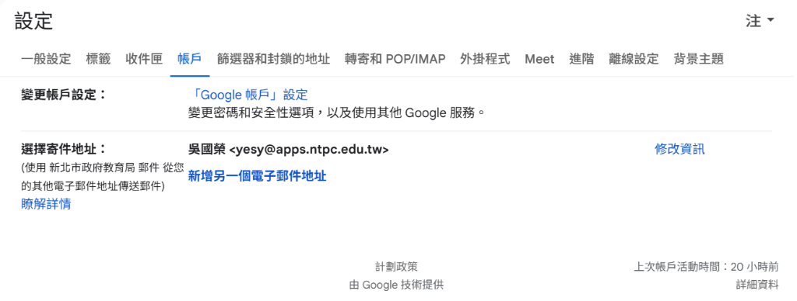
*圖 2：學校教育版帳號（分頁為「帳戶」，若教育局管理後台關閉委派，此功能會被系統隱藏）*

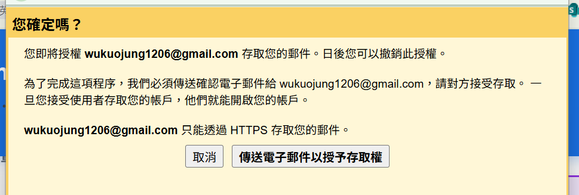
*圖 3：授予存取權確認對話框（點擊「傳送電子郵件以授予存取權」）*

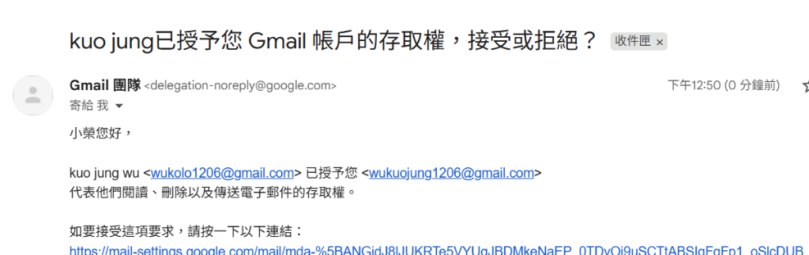
*圖 4：代理人信箱收到之授權確認信（點擊接受存取要求連結）*

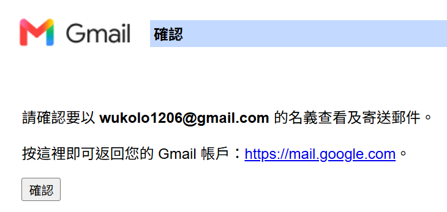
*圖 5：點選「確認」完成接受代理人授權*

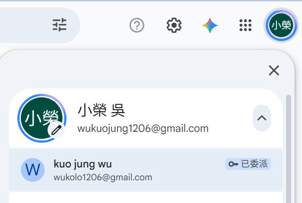
*圖 6：代理人點擊右上角個人頭像，選擇「已委派 (Delegated)」帳戶即可免密碼切換進入！*

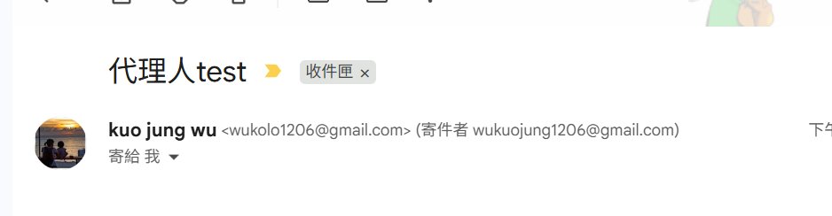
*圖 7：最終成果——收件者端清楚顯示「主管帳號 (寄件者 代理人帳號)」，責任歸屬一目了然！*

##### 🛡️ 代理授權 (Grant Access) 核心效果與資安效益：
- **免密碼安全切換**：代理人點選「已委派」帳戶即可開新分頁代收代發，完全不必得知主管密碼。
- **寄件者清楚標記**：信件寄出時收件者會看到 `由「代理人」代表「主管」傳送`，責任歸屬明確。
- **資安完全隔離**：代理人無法變更密碼或查看主管個人雲端硬碟私密檔案，隨時可一鍵撤銷授權。

- **💡 研習實作提醒**：現場上機演練請使用**個人 `@gmail.com` 帳號**互加代理人，避免受限於學校網域管理員設定。
- **🎯 實務情境課題**：主管需要授權秘書代表自己發送公文郵件，且不透露密碼。
- **🛠️ 指定工具功能**：Gmail **授予您帳戶的存取權 (Grant Access)**
- **▶️ 手把手實操步驟**：
  1. 進入 Gmail 右上角「設定 ➔ 查看所有設定 ➔ 帳戶與匯入」。
  2. 在「授予您帳戶的存取權」點選「新增其他帳戶」輸入代理人 Email。
  3. 代理人至信箱點選確認連結完成接受。
- **✨ 成果驗證點**：秘書可在其 Gmail 中切換並代表主管發信。

---

#### 演練 25

##### 🔍 觀念解密：【圖形搜尋選單】vs【鍵盤運算子指令】一對一完全對照
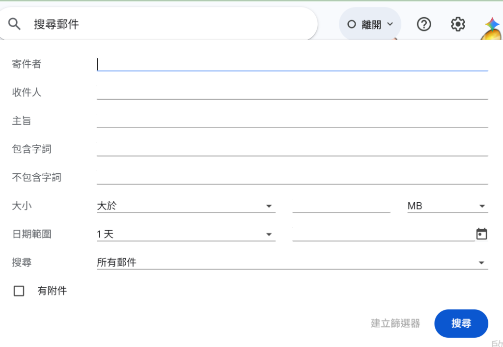
*圖 9：點擊搜尋列右側展開的「搜尋選項面板」各欄位與運算子指令 100% 對應*

| 圖形面板欄位 (滑鼠填表) | 對應的搜尋運算子 (鍵盤指令) | 實務範例說明 |
| :--- | :--- | :--- |
| **寄件者** | `from:` | `from:教務處` 或 `from:apps.ntpc.edu.tw` |
| **收件人** | `to:` | `to:家長會` |
| **主旨** | `subject:` | `subject:校外教學` |
| **包含字詞** | 直接輸入關鍵字 | `校務會議 提案` |
| **不包含字詞** | `-` (減號排除) | `-廣告 -促銷` |
| **勾選「有附件」** | `has:attachment` | `has:attachment filename:xlsx` |
| **大小大於** | `larger:` 或 `size:` | `larger:5M` (清理超大容量信件) |
| **日期範圍** | `after:` / `before:` | `after:2025/09/01 before:2026/01/20` |

##### ⚙️ 步驟前置作業：在「進階」設定中啟用【範本 (Templates)】
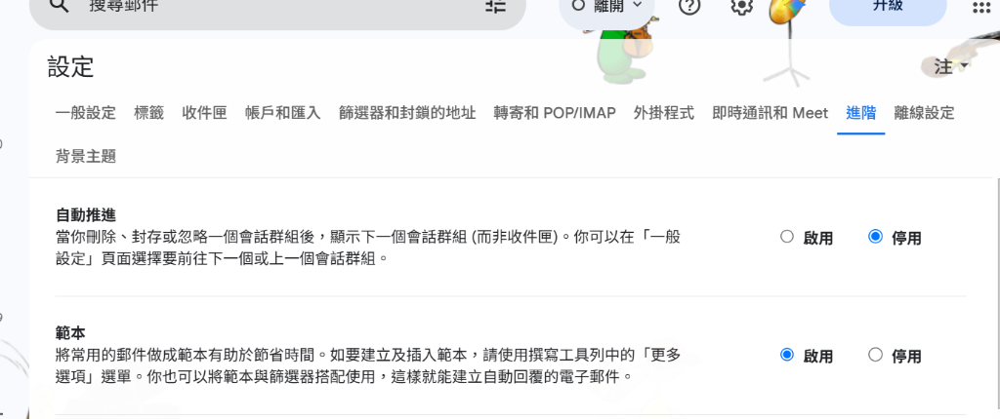
*進入「設定 ➔ 進階」將「範本」勾選為【啟用】，並捲動至底部點選「儲存變更」*

##### ⚖️ 關鍵觀念深度解析：【✍️ 簽名檔 (Signature)】vs【📋 範本 (Templates)】
> **一句話辨析**：「每封信結尾自動帶入的叫『簽名檔』；整篇完整信件內容重複叫出的叫『範本』！」

| 比較面向 | ✍️ 簽名檔 (Signature) | 📋 範本 (Templates / 舊稱罐頭回應) |
| :--- | :--- | :--- |
| **📍 設定路徑** | `設定 ➔ 一般設定 ➔ 簽名` | `設定 ➔ 進階 ➔ 啟用範本` （撰寫時：右下角三點 ➔ 範本） |
| **⚡ 觸發方式** | **自動產生**：按撰寫或回覆時自動附加於信末 | **手動插入 / 規則觸發**：手動套用或由篩選器自動回信 |
| **📝 內容性質** | **名片資訊**：姓名、職稱、分機、Logo、問候語 | **整篇完整文章**：主旨、正文、條列事項、常見問答 |
| **🏫 學校應用** | 行政名片、導師聯絡資訊、免責聲明 | 校外教學通告、請假補課流程、家長會常態詢問 |

##### 📋 演練三推薦範本文章（校外教學行前準備通告）：
- **主旨**：`【重要通知】○○國小 ○年○班 校外教學行前準備與注意事項通知`
- **內文**：
  > 各位家長好： 
  > 本學期班級校外教學參訪活動即將於下週舉行，為了讓孩子們能有充實且安全的學習體驗，請家長協助提醒與準備以下事項：  
  > 📍 **【活動資訊】** 
  > 1. 集合時間：○月○日（星期○）上午 07:50 前於教室集合完畢 
  > 2. 參訪地點：新北市立十三行博物館 
  > 3. 預計返校：下午 15:30（依當天交通路況為準）  
  > 🎒 **【必備隨身物品】** 
  > • 穿著學校體育服、運動鞋 
  > • 輕便雙肩背包（裝水壺、輕便雨衣、個人常備藥品） 
  > • 健保卡、悠遊卡（請先儲值）  
  > 若當天有任何突發狀況需請假，請於 07:30 前透過班級官方管道或撥打學校分機告知導師。 
  > 感謝家長的配合與支持！  
  > 導師 敬上

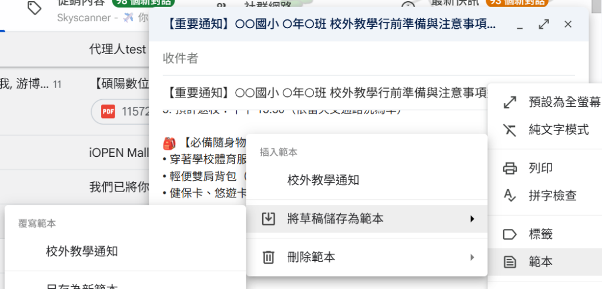
*圖 8：撰寫郵件時，由右下角「三點 ➔ 範本 ➔ 將草稿儲存為範本」儲存或一鍵套用範本！*

- **🎯 實務情境課題**：共同編輯 Docs 文件時，希望直接在文件右上角發起 Meet 視訊邊討論邊修改。
- **🛠️ 指定工具功能**：Google Docs/Slides **檔案內 Meet 整合**
- **▶️ 手把手實操步驟**：
  1. 在 Docs 右上角點選 Meet 視訊圖示。
  2. 點選「在此發起新會議」並分享畫面。
- **✨ 成果驗證點**：視訊畫面浮動於文件右側，實現實時檔案內協作。
