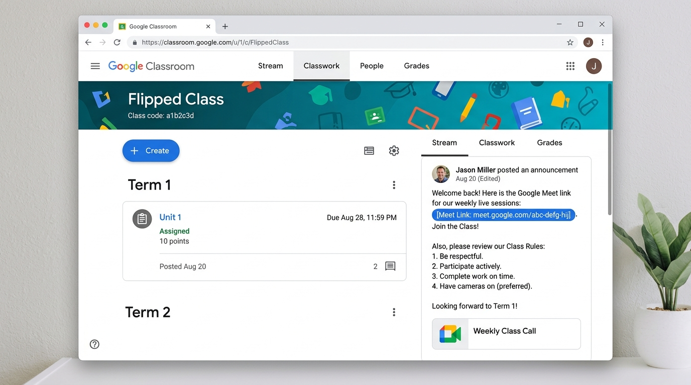

# Google Certified Educator Level 2 - Lab Exam 1
## Google Classroom Lab A Exam (Official Performance-Based Exam)

### 📋 Exam Overview & Scenario
An educator is setting up a new class in Google Classroom. They use Classroom features to organize learning materials, assign tasks, and communicate with students.

---

*▲ 圖：Google Classroom Lab 1 實作設定完成介面示意圖*

### 🚀 Task 1: Create a Class in Google Classroom (建立班級)

* **English Instructions**:
  Create a class in Google Classroom instance.
  - Create a class named Flipped Class.
  - Click **Check my progress** to verify the objective.

* **繁體中文操作指引與對照**:
  在 Google Classroom 中建立全新的課程。
  - **課程名稱 (Class name)**：設定為 Flipped Class (翻轉教室)。
  - 完成後點選右側選單之 **Check my progress (檢查我的進度)** 按鈕進行自動評分驗證。

---

### 👥 Task 2: Invite Members (邀請協同教師與學生)

* **English Instructions**:
  Utilize email IDs of teacher and student list from a Google Sheets spreadsheet named 5th Grade List saved to your Drive to invite these individuals as co-teachers and students, respectively.
  - Click **Check my progress** to verify the objective.

* **繁體中文操作指引與對照**:
  從雲端硬碟 (Google Drive) 開啟名為 5th Grade List 的 Google 試算表：
  - 開啟檔案並複製「Teacher (教師)」與「Student (學生)」分頁或欄位中的 Email 清單。
  - 進入 Flipped Class 的 **「成員 (People)」** 頁籤。
  - 在「教師 (Teachers)」分頁點選邀請圖示，貼上教師 Email 邀請為 **協同教師 (Co-teacher)**。
  - 在「學生 (Students)」分頁點選邀請圖示，貼上學生 Email 清單進行 **學生邀請**。
  - 完成後點選 **Check my progress** 進行自動評分驗證。

---

### 🏷️ Task 3: Create Two Topics (建立兩個主題)

* **English Instructions**:
  Create two topics:
  - Topic 1: Term 1
  - Topic 2: Term 2
  - Click **Check my progress** to verify the objective.

* **繁體中文操作指引與對照**:
  進入 **「課堂作業 (Classwork)」** 頁籤，點選「＋建立 (＋Create)」 $\rightarrow$ 「主題 (Topic)」：
  - 建立第一個主題：Term 1 (第一學期)。
  - 建立第二個主題：Term 2 (第二學期)。
  - 完成後點選 **Check my progress** 進行自動評分驗證。

---

### 📝 Task 4: Create an Assignment and Materials (建立作業與教學素材)

* **English Instructions**:
  1. Create an assignment named Unit 1 and configure:
     - Add a file from Drive named 5th Grade Poetic Devices.
     - Set Points: 10
     - Due date: 
ext week (下週指定日期)
     - Topic: Term 1
     - Click **Assign** to assign it.
  2. Create materials named Unit 1 Readings:
     - Attach a file from Drive named 5th Grade Poetry: Unit 1 Reading List.
     - Click **Post**.
  - Click **Check my progress** to verify the objective.

* **繁體中文操作指引與對照**:
  1. **建立作業 (Create Assignment)**：
     - 在「課堂作業」點選「＋建立 $\rightarrow$ 作業」。
     - **標題 (Title)**：Unit 1。
     - **夾帶檔案**：點選 Drive 圖示，附加雲端硬碟中名為 5th Grade Poetic Devices 的檔案。
     - **分數 (Points)**：改為 10 分。
     - **截止日期 (Due date)**：設定為下週同一天。
     - **主題 (Topic)**：選擇 Term 1。
     - 點選右上角 **「出題 / Assign」**。
  2. **建立教材 (Create Material)**：
     - 點選「＋建立 $\rightarrow$ 教材 (Material)」。
     - **標題 (Title)**：Unit 1 Readings。
     - **夾帶檔案**：點選 Drive 圖示，附加雲端硬碟中名為 5th Grade Poetry: Unit 1 Reading List 的檔案。
     - 點選右上角 **「發布 / Post」**。
  - 完成後點選 **Check my progress** 進行自動評分驗證。

---

### 📢 Task 5: Create an Announcement (發布班級公告)

* **English Instructions**:
  Start to draft an announcement reminding students about an upcoming online session:
  - Include description: Reminder: You have an upcoming online session.
  - Include a **Google Meet link**.
  - List the rules: Arrive on time; Keep mics muted; Raise hands to speak.
  - Click **Post**.
  - Click **Check my progress** to verify the objective.

* **繁體中文操作指引與對照**:
  進入 **「訊息串 (Stream)」** 頁籤，點選「宣布事項 (Announce something to your class)」：
  - **公告內容 (Description)**：輸入 Reminder: You have an upcoming online session.
  - **附帶連結**：點選「新增 Google Meet 連結」或附加 Meet 視訊會議網址。
  - **條列規則**：輸入 Arrive on time; Keep mics muted; Raise hands to speak. (準時出席；麥克風保持靜音；發言請舉手)。
  - 點選右下角 **「發布 / Post」**。
  - 完成後點選 **Check my progress** 進行自動評分驗證。

---

### 💡 官方評分地雷與注意事項 (Lab Tips & Pitfalls)
1. **名稱精確度 (Exact Match)**：所有名稱（如 Flipped Class, Term 1, Unit 1, Reminder: You have an upcoming online session.）必須與英文完全相同，大小寫與空格不得有誤，否則自動評分系統會判為失敗。
2. **檔案選取**：Task 2 的成員名單必須從 Drive 上的 5th Grade List 讀取，Task 4 夾帶檔案名稱亦需完全相符。
3. **無痕模式 (Incognito Window)**：進行 Lab 實作時，務必開啟無痕視窗或專用代理視窗 (Guacamole)，避免個人 Gmail 帳號干擾測驗 Learner 帳號之自動評分判定。
