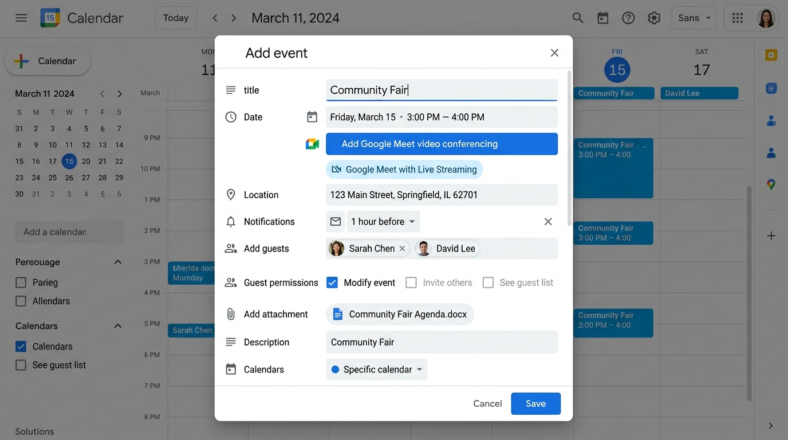

# Google Certified Educator Level 2 - Lab Exam 2
## Google Calendar Lab Exam (Official Performance-Based Exam)

### 📋 Exam Overview & Scenario
A school is planning to host a hybrid Community Fair. They want to ensure the entire community can participate, whether in person or virtually. Create a Google Calendar event to achieve the goal.

---

*▲ 圖：Google Calendar Lab 2 實作設定完成介面示意圖*

### 📅 Task 1: Create a Google Calendar Event (建立行事曆活動與夾帶檔案)

* **English Instructions**:
  Create a Google Calendar event that is configured as follows:
  - Give the Google Calendar event the title of Community Fair.
  - Set the date and time from 3pm to 4pm next Friday.
  - Attach a file named Community Fair Agenda that's located in your Drive.

* **繁體中文操作指引與對照**:
  開啟 Google 日曆 (Google Calendar)，在下週五的 15:00 - 16:00 (3pm to 4pm) 時段點選新增活動：
  - **活動標題 (Title)**：輸入 Community Fair (社區市集)。
  - **時間設定 (Date & Time)**：選取下週五 (Next Friday) 下午 15:00 至 16:00。
  - **夾帶檔案 (Attachment)**：點選「新增說明或附件 (Add description or attachments)」 $\rightarrow$ 附件 (Paperclip 圖示)，從雲端硬碟 (Drive) 選擇名為 Community Fair Agenda 的檔案進行附加。

---

### 🎥 Task 2: Configure Google Meet for Live Streaming (設定 Meet 串流直播)

* **English Instructions**:
  Set up Google Meet to allow live streaming:
  - Allow guests to join via Google Meet.
  - Enable guests to attend with live streaming.

* **繁體中文操作指引與對照**:
  在 Community Fair 活動編輯畫面中：
  - 點選 **「新增 Google Meet 視訊會議 (Add Google Meet video conferencing)」**。
  - 點選視訊會議旁的 **設定齒輪 (Video call options)** 浮動選單。
  - 選擇或開啟 **「串流 (Live Stream) / 新增串流」** 功能，讓無法現場與會的社群成員能透過線上直播觀看。

---

### 📍 Task 3: Add a Location (新增活動地點)

* **English Instructions**:
  Add the meeting location as 123 Main Street to the Community Fair event.

* **繁體中文操作指引與對照**:
  在活動編輯欄位中尋找 **「新增地點 (Add location)」**：
  - **地點欄位**：精確輸入 123 Main Street。

---

### 🔔 Task 4: Set a Personal Notification (設定電子郵件提醒通知)

* **English Instructions**:
  Set a personal notification to alert attendees 1 hour via email before the event.

* **繁體中文操作指引與對照**:
  在活動編輯畫面中尋找 **「通知 (Notification)」** 設定：
  - 點選「新增通知 (Add notification)」。
  - 將通知類型從預設的「通知 (Notification)」切換為 **「電子郵件 (Email)」**。
  - 時間時間長度改為 **1 小時前 (1 hour)** (即活動開始前 1 小時寄發 Email 提醒)。

---

### 👥 Task 5: Invite Guests and Modify Settings (邀請參加者與隱私權限制)

* **English Instructions**:
  Invite guests to the event and modify guest settings:
  - Utilize a Google Sheets spreadsheet, Community Fair Invite List, saved in your Drive to invite people.
  - Modify guest settings such that guests **cannot invite others** and **cannot see other guests' emails**.
  - Click **Check my progress** to verify the objective.

* **繁體中文操作指引與對照**:
  1. 開啟 Drive 中名為 Community Fair Invite List 的 Google 試算表，複製裡面的 Email 名單。
  2. 回到 Calendar 的 **「新增與會者 (Add guests)」** 欄位，貼上 Email 名單進行邀請。
  3. **修改與會者權限 (Guest permissions)**（關鍵考核點！）：
     - ❌ **取消勾選「邀請其他人 (Invite others)」** (防止與會者隨意轉發邀請)。
     - ❌ **取消勾選「查看參加者名單 (See guest list)」** (保護與會者 Email 隱私，防止互相看到聯絡信箱)。
  4. 完成後點選右上角 **「儲存 (Save)」**，並點選 **Check my progress** 進行自動評分驗證。

---

### 💡 官方評分地雷與注意事項 (Lab Tips & Pitfalls)

1. **與會者權限限制 (Guest Permissions)**：Task 5 是最容易失分的考點！必須明確取消勾選「Invite others」與「See guest list」，這完全對應官方 Level 2 親師/社群隱私防護教學規範。
2. **通知類型 (Email Notification)**：務必確認通知類型選擇的是 **Email (電子郵件)**，而非一般瀏覽器彈出通知 (Notification)。
3. **名稱與地址精確比對**：
   - 標題：Community Fair
   - 地點：123 Main Street
   - 附件：Community Fair Agenda
   - 名單試算表：Community Fair Invite List
