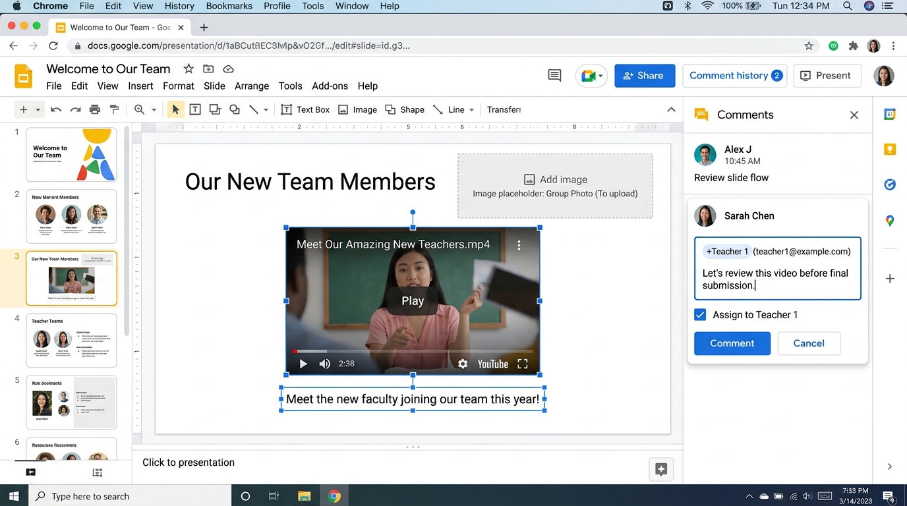

# Google Certified Educator Level 2 - Lab Exam 3
## Google Slides Lab Exam (Official Performance-Based Exam)

### 📋 Exam Overview & Scenario
A team of educators are working on building a collaborative Google Slides presentation for a class orientation so that all of their information will be in one place.

---

*▲ 圖：Google Slides Lab 3 實作設定完成介面示意圖*

### 🎨 Task 1: Create a Title Slide for the Presentation (建立簡報與標題頁)

* **English Instructions**:
  Create a Google Slides presentation named Welcome to Our Team.
  - Add a slide to the presentation with the title Welcome to Our Team.
  - Insert an image named handclap.png located in your Google Drive onto the title slide.
  - Click **Check my progress** to verify the objective.

* **繁體中文操作指引與對照**:
  建立名為 Welcome to Our Team 的 Google 簡報：
  - **簡報檔名與封面標題 (Title)**：輸入 Welcome to Our Team (歡迎來到我們的團隊)。
  - **插入封面圖片**：點選「插入 (Insert) $\rightarrow$ 圖片 (Image) $\rightarrow$ 雲端硬碟 (Drive)」，選擇名為 handclap.png 的圖片並放至封面投影片。
  - 完成後點選 **Check my progress** 進行評分驗證。

---

### 📄 Task 2: Create Template Slides, Theme Placeholder & Share (建立教師樣版、主題預留位置與共用)

* **English Instructions**:
  1. Add three new slides with Title and Body layout. Titles: Teacher 1, Teacher 2, Teacher 3.
  2. Enter body content directly into slides (DO NOT use Theme Builder for text):
     `
     Name
     Room #
     Office Phone Number
     Email Address
     Favorite Quote
     `
  3. Share the presentation with Teacher 1, Teacher 2, Teacher 3 with **Editor** access.
  4. Edit the **Theme Builder** (檢視 $\rightarrow$ 編輯主題):
     - Create a layout slide named Image Placeholder.
     - Add a **rectangular image placeholder** to the slide.
     - Add a new slide to the presentation and apply the Image Placeholder layout.
  - Click **Check my progress** to verify the objective.

* **繁體中文操作指引與對照**:
  1. **新增教師簡報頁**：新增 3 張「標題與內文 (Title and Body)」格式的投影片，標題分別輸入 Teacher 1、Teacher 2、Teacher 3。內文直接貼上以下欄位名稱：
     `	ext
     Name
     Room #
     Office Phone Number
     Email Address
     Favorite Quote
     `
     *(⚠️ 警告：內文請直接在投影片文字框輸入，切勿在主題建構工具中輸入！)*
  2. **共用編輯權限**：點選「共用 (Share)」，輸入 Teacher 1、Teacher 2、Teacher 3 的 Email，權限設定為 **「編輯者 (Editor)」**。
  3. **主題建構工具預留位置 (Theme Builder)**：
     - 點選上方選單 **「檢視 (View) $\rightarrow$ 主題建構工具 (Theme builder / 編輯主題)」**。
     - 點選「＋新增版面配置」，將此版面命名為 Image Placeholder。
     - 點選選單「插入 $\rightarrow$ 預留位置 (Placeholder) $\rightarrow$ **圖片預留位置 (Image placeholder)**」，畫一個矩形預留位置。
     - 關閉主題建構工具，回到簡報新增一張投影片，並將版面套用為 Image Placeholder。
  - 完成後點選 **Check my progress** 進行自動評分驗證。

---

### 📌 Task 3: Assign Slides to Colleagues Using Comments (透過批註指派簡報頁)

* **English Instructions**:
  Create five separate slides using Title and Body layout to highlight orientation aspects. Add a comment to each slide to **assign** slides to colleagues:
  - Schedule $\rightarrow$ Assign to Teacher 1
  - Classroom Expectations $\rightarrow$ Assign to Teacher 1
  - Field Trips $\rightarrow$ Assign to Teacher 2
  - Academic Support $\rightarrow$ Assign to Teacher 2
  - Important Documents $\rightarrow$ Assign to Teacher 3
  - Click **Check my progress** to verify the objective.

* **繁體中文操作指引與對照**:
  新增 5 張「標題與內文」投影片，標題與批註指派對照如下：
  1. **標題 Schedule**：新增批註 (Ctrl+Alt+M)，輸入 +Teacher 1 的 Email，**務必勾選「指派給 Teacher 1 (Assign to Teacher 1)」**。
  2. **標題 Classroom Expectations**：新增批註，輸入 +Teacher 1 的 Email 並勾選指派。
  3. **標題 Field Trips**：新增批註，輸入 +Teacher 2 的 Email 並勾選指派。
  4. **標題 Academic Support**：新增批註，輸入 +Teacher 2 的 Email 並勾選指派。
  5. **標題 Important Documents**：新增批註，輸入 +Teacher 3 的 Email 並勾選指派。
  - 完成後點選 **Check my progress** 進行評分驗證。

---

### 🎬 Task 4: Add a Video to a Slide (內嵌 Drive 影片)

* **English Instructions**:
  A video named Meet Our Amazing New Teachers.mp4 is available in your Google Drive. Insert this video into a blank new slide.
  - Click **Check my progress** to verify the objective.

* **繁體中文操作指引與對照**:
  新增一張空白投影片 (Blank slide)：
  - 點選 **「插入 (Insert) $\rightarrow$ 影片 (Video)」**。
  - 切換至 **「Google 雲端硬碟 (Google Drive)」** 分頁。
  - 選擇名為 Meet Our Amazing New Teachers.mp4 的影片檔案進行插入。
  - 完成後點選 **Check my progress** 進行評分驗證。

---

### 👁️ Task 5: Share Presentation with Education Leader (分享給主管審閱權限)

* **English Instructions**:
  Share the presentation with the Education leader for review with **Commenter** access.
  - Click **Check my progress** to verify the objective.

* **繁體中文操作指引與對照**:
  點選右上角 **「共用 (Share)」** 按鈕：
  - 輸入 Education leader 的 Email 地址。
  - 權限切換為 **「註解者 (Commenter)」**（注意：非 Editor 也非 Viewer）。
  - 點選「發送 / 儲存」。
  - 完成後點選 **Check my progress** 進行自動評分驗證。

---

### 💡 官方評分地雷與注意事項 (Lab Tips & Pitfalls)

1. **批註指派 (Assign Action)**：Task 3 在新增註解時，**必須手動勾選「指派給... (Assign to...)」小方塊**，單純輸入文字不會觸發任務完成。
2. **主題預留位置 (Theme Builder)**：Task 2 的矩形圖片預留位置必須在 Theme Builder 中建立，並命名為 Image Placeholder；但內文文字請直接在一般投影片中輸入。
3. **權限精確度 (Commenter Access)**：Task 5 分享給主管時，權限必須設定為 **Commenter (註解者)**。
